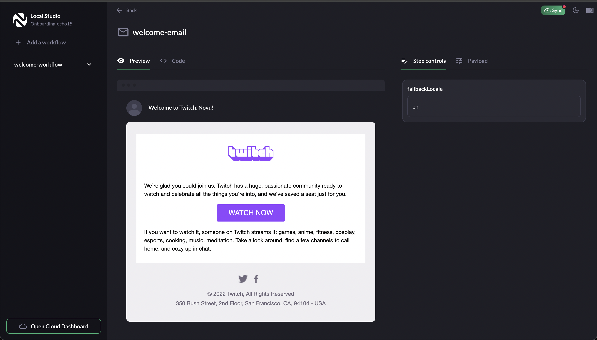
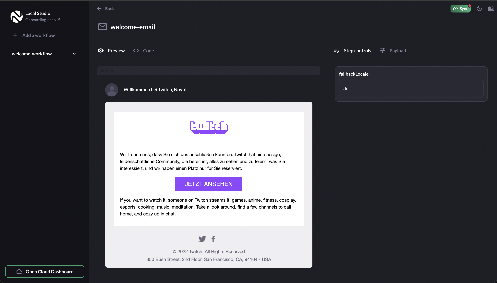

## Twitch Translated Workflow

What you will find here:

- A workflow for sending translated content.
- The ability for product teams to control default language.
- Twitch designed email as an inspiration.

## Steps

1. Clone the repo and cd into `translation` directory.

2. Run `npm install && npm run dev` to run the project.

3. Open a new terminal and run `npx novu@latest dev`

## Send email

English

German
